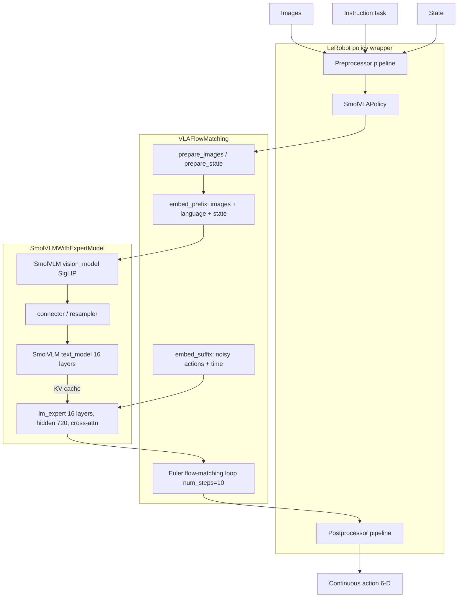

# SmolVLA model report

This report describes **SmolVLA from the model’s perspective**, using the installed checkpoint [`lerobot/smolvla_base`](https://huggingface.co/lerobot/smolvla_base) and the LeRobot 0.6.1 implementation.

Paper: [SmolVLA: A Vision-Language-Action Model for Affordable and Efficient Robotics](https://arxiv.org/abs/2506.01844)
Reference code: `lerobot.policies.smolvla` in [huggingface/lerobot](https://github.com/huggingface/lerobot)

---

## 0. Where SmolVLA sits in a real robot loop

Think of a follower arm on a table, with cameras watching the scene and a language task such as “put the lego brick in the box.”

On each cycle the stack does four coarse things:

1. **Sense.** Read the cameras, the current arm joints and gripper, and the task string.
2. **Ask the policy.** Hand that snapshot to SmolVLA. The model does not drive motors itself; it only turns “what I see, where I am, what I was asked to do” into a short burst of motor commands.
3. **Act.** The robot runtime plays those commands on the same joints and gripper, one control tick at a time.
4. **Look again.** When that burst is used up, take a fresh snapshot and call the policy once more.

That loop repeats until the episode ends. SmolVLA is the mapping in step 2: **images + instruction + current pose → next motor targets**. The rest of this report is how that mapping is configured and implemented.

---

## 1. Configuration and key dependencies

### 1.1 Checkpoint identity

| Item | Value |
|---|---|
| Hub id | `lerobot/smolvla_base` |
| Policy type | `smolvla` |
| Parameter count (this env) | 450,046,176 (~450M) |
| Weight dtypes | `bfloat16` (VLM) + `float32` (action/state heads) |
| Training objective | Flow matching on continuous actions |
| Intended use | Base VLA to fine-tune on a robot-specific dataset |

Checkpoint `config.json` ships `"device": "cuda"`. On a CPU-only host LeRobot switches the policy to `cpu`.

### 1.2 SmolVLA policy config (`SmolVLAConfig` / `smolvla_base`)

**I/O layout (this checkpoint)**

| Feature | Type | Shape |
|---|---|---|
| `observation.state` | STATE | `(6,)` |
| `observation.images.camera1` | VISUAL | `(3, 256, 256)` |
| `observation.images.camera2` | VISUAL | `(3, 256, 256)` |
| `observation.images.camera3` | VISUAL | `(3, 256, 256)` |
| `action` | ACTION | `(6,)` |

**Temporal / decoding**

| Setting | Value | Meaning |
|---|---|---|
| `n_obs_steps` | 1 | One observation timestep per call |
| `chunk_size` | 50 | Action horizon predicted per model invocation |
| `n_action_steps` | 50 | Steps consumed from that chunk (`select_action` queue) |
| `num_steps` | 10 | Euler integration steps for flow-matching decode |
| `use_cache` | true | KV-cache the VLM prefix (images + language + state) |

**Internal padding / image prep**

| Setting | Value | Meaning |
|---|---|---|
| `max_state_dim` | 32 | State is padded from 6 → 32 before `state_proj` |
| `max_action_dim` | 32 | Action tokens live in 32-D; only first 6 are used |
| `resize_imgs_with_padding` | `(512, 512)` | Pad-resize to 512×512 (width, height) for SigLIP |
| `empty_cameras` | 0 | Do not synthesize missing camera views |
| `normalization_mapping` | VISUAL=`IDENTITY`, STATE/ACTION=`MEAN_STD` | Images stay in `[0, 1]` until the model maps them to `[-1, 1]` |

**Language / VLM backbone**

`tokenizer_max_length` is a SmolVLA config field. **Token embedding dim is not** — it is inherited from the SmolVLM2 backbone (`text_config.hidden_size`) and never appears in `smolvla_base` `config.json`.

| Setting | Value | Where it lives | Meaning |
|---|---|---|---|
| `vlm_model_name` | `HuggingFaceTB/SmolVLM2-500M-Video-Instruct` | `SmolVLAConfig` | Which VLM/tokenizer to load |
| `load_vlm_weights` | `true` | `SmolVLAConfig` | Load pretrained SmolVLM2 weights |
| `tokenizer_max_length` | 48 | `SmolVLAConfig` | Max **number of token IDs** in the instruction (`B, 48`) |
| `pad_language_to` | `max_length` | `SmolVLAConfig` | Always pad/truncate to 48 tokens |
| **token embedding dim** | **960** | SmolVLM2 `text_config.hidden_size` (not in SmolVLA config) | Vector size of **each** token after embedding lookup (`B, 48, 960`) |
| expert hidden size | 720 | derived: `0.75 × 960` | Action-expert width (`expert_width_multiplier`) |

So: discrete `token_id` → embedding table → vector of length **960**. 48 is sequence length, not vector size.

**VLM / expert structure (SmolVLAConfig)**

| Setting | Value |
|---|---|
| `num_vlm_layers` | 16 (backbone originally has 32; first 16 kept) |
| `num_expert_layers` | 0 → expert uses the same layer count as the truncated VLM (16) |
| `attention_mode` | `cross_attn` |
| `self_attn_every_n_layers` | 2 (interleave self-attention in the expert) |
| `expert_width_multiplier` | 0.75 (expert hidden size = `0.75 × 960 = 720`) |
| `add_image_special_tokens` | `false` |
| `freeze_vision_encoder` | `true` |
| `train_expert_only` | `true` |
| `train_state_proj` | `true` |

**Flow-matching time embedding**

| Setting | Value |
|---|---|
| `min_period` | 0.004 |
| `max_period` | 4.0 |

**Backbone text config (SmolVLM2)**

| Setting | Value |
|---|---|
| Architecture | `SmolVLMForConditionalGeneration` |
| Text model | Llama-style |
| `hidden_size` (**token / language embedding dim**) | **960** |
| `num_attention_heads` | 15 |
| `num_key_value_heads` | 5 |
| `head_dim` | 64 |
| Original text depth | 32 layers (SmolVLA keeps 16) |
| Vision path | SmolVLM `vision_model` (SigLIP) + `connector` resampler |

### 1.3 Runtime / library versions used in this environment

| Package | Version | Role for SmolVLA |
|---|---|---|
| Python | 3.12.13 | LeRobot requires `>=3.12` |
| lerobot | 0.6.1 | Policy, processors, CLI |
| torch | 2.11.0+cpu | Model + flow-matching integrate |
| torchvision | 0.26.0+cpu | Image helpers |
| transformers | 5.5.4 | Load SmolVLM2 + tokenizer/processor |
| accelerate | 1.15.0 | `lerobot[smolvla]` extra |
| tokenizers | 0.22.2 | Fast tokenizer |
| safetensors | 0.8.0 | Checkpoint I/O |
| huggingface_hub | 1.32.0 | Download `smolvla_base` and SmolVLM2 |
| num2words | 0.5.14 | `lerobot[smolvla]` extra |
| numpy | 2.2.6 | Arrays |
| opencv-python-headless | 4.13.0.92 | Camera/image tooling in LeRobot |
| einops | 0.8.2 | Tensor reshape helpers |
| draccus | 0.11.6 | CLI/config parsing |
| datasets | 4.8.5 | Optional `LeRobotDataset` path |
| torchcodec | 0.11.1+cpu | Dataset video decode (not used in dummy smoke test) |

LeRobot extra used: `lerobot[smolvla]` (`transformers` + `num2words` + `accelerate`).
This CPU install also added `dataset` and `core_scripts` for dataset loading and `lerobot-record` / `lerobot-rollout`.

---

## 2. Model-level input and output

SmolVLA is a **vision–language–action** model. At the policy boundary it consumes a multimodal observation and emits a **continuous action**. It does not emit text.

### 2.1 Inputs the model actually uses

Three modalities, all required for a normal forward:

1. **Images (vision)**
   Multi-view RGB. This checkpoint expects up to three cameras:

   - keys: `observation.images.camera1|camera2|camera3`
   - declared shape: `C×H×W = 3×256×256`
   - value range into the policy: float `[0, 1]`
   - inside `prepare_images`: pad-resize to **512×512**, then map to **`[-1, 1]`** for SigLIP

   At least one camera must be present. Missing cameras are not filled unless `empty_cameras > 0`.

2. **Language instruction**
   Natural-language task string, field name `task` (example: `"Put lego brick into the transparent box"`).

   The preprocessor:

   - appends a newline (`smolvla_new_line_processor`)
   - tokenizes with the **SmolVLM2** tokenizer (`max_length=48`, right pad, truncation)
   - writes `observation.language.tokens` shape `(B, 48)` (integer token IDs)
   - writes `observation.language.attention_mask` shape `(B, 48)`

   **`B` is usually 1.** On a real robot there is one instruction string, so tokens are `(1, 48)`.

   Embedding lookup then maps each ID to a 960-D vector: `(B, 48) → (B, 48, 960)`.
   `tokenizer_max_length=48` is **not** that 960-D width. There is no separate text decoder at inference; language only conditions the action expert.

3. **Proprio / state**
   `observation.state`, shape `(6,)`. Mean/std-normalized, then padded to `(32,)` and projected by `state_proj` into the VLM hidden size (960).

`n_obs_steps=1`, so the model conditions on the **current** observation only (no observation history stack).

### 2.2 Outputs the model produces

| Stage | Tensor | Shape | Meaning |
|---|---|---|---|
| Flow-matching decode | action chunk | `(B, 50, 32)` internally, cropped to `(B, 50, 6)` | Continuous actions over `chunk_size` steps |
| `predict_action_chunk` | chunk | `(B, 50, 6)` | Full horizon |
| `select_action` | one step | `(B, 6)` | Pops the next action from a 50-step queue |
| After postprocessor | robot action | `(B, 6)` on CPU | Mean/std **unnormalized** back to dataset/robot scale |

Action representation is **continuous**, not tokenized. Training predicts the flow-matching vector field `u_t = noise - actions` with MSE; inference Euler-integrates from noise to an action chunk in `num_steps=10`.

### 2.3 End-to-end workflow

For a real robot, **`B = 1`**. The batch dimension is retained below because the same model also supports training batches.

#### Runtime frequency wrapper

The four model stages run inside a robot-control wrapper. The wrapper—not SmolVLA—defines the control frequency `f_control` (for example, through a rollout/record `fps` setting).

```
Robot control loop at f_control Hz
        |
        +-- action queue not empty:
        |       pop one (B, 6) command and send it to the robot
        |
        +-- action queue empty:
                read new cameras + state
                run Stages 0 and 2 once
                run (Stage 1 -> Stage 3 Euler step) 10 times
                produce and queue 50 commands
                pop and send the first command
```

Let:

```
N         = n_action_steps
f_control = robot control frequency in Hz
T_infer   = wall-clock time for one full chunk inference
M         = num_steps (Euler evaluations per chunk inference)
```

`N` is a count of control ticks. The queue-execution timing is:

```
duration of one action        = 1 / f_control seconds
duration of N queued actions  = N / f_control seconds
required chunk rate           = f_control / N chunks per second
```

The required chunk rate is the rate at which new chunks must become available to keep the robot continuously supplied with actions. This is separate from:

- **Control frequency:** one queued command is sent every robot tick.
- **Chunk-inference frequency:** how often the policy produces a new chunk.
- **Euler evaluations:** `M` action-expert evaluations inside one chunk inference; these are numerical solver steps, not robot ticks or a control frequency.

For **synchronous** inference, prediction and queue execution happen sequentially:

```
T_cycle_sync ≈ T_infer + N / f_control
f_chunk_sync ≈ 1 / (T_infer + N / f_control)
```

For an idealized **asynchronous** one-chunk pipeline, inference overlaps execution:

```
T_cycle_async ≈ max(T_infer, N / f_control)
f_chunk_async ≈ 1 / max(T_infer, N / f_control)
              = min(1 / T_infer, f_control / N)
```

Continuous execution without exhausting the queue requires approximately, meaning the model infer time is completely overlapped by the command execution:

```
T_infer <= N / f_control
```

For fixed `N`, a higher desired control frequency therefore requires lower model latency:

```
maximum latency budget                  = N / f_control
maximum sustainable control frequency   = N / T_infer
minimum actions required to hide latency = ceil(T_infer * f_control)
```

For example, doubling `f_control` while keeping `N` unchanged halves the available inference-time budget.

The first inequality assumes inference starts while the full `N`-action horizon remains. More precisely, if asynchronous inference is triggered when `R` queued actions remain:

```
T_infer <= R / f_control
R >= ceil(T_infer * f_control)
```

In practice, `R` should include a safety margin for variable inference latency, communication, and control-loop jitter. Increasing `N` or triggering earlier gives inference more time, but may use older observations and commit the robot to a longer open-loop horizon.

Actual asynchronous scheduling also includes trigger thresholds, communication, delay alignment, and chunk merging.

For this checkpoint, `N = n_action_steps = 50` and `M = num_steps = 10`. Therefore:

- At 10 Hz: 50 actions take 5 seconds.
- At 30 Hz: 50 actions take `50/30 ≈ 1.67` seconds, requiring `30/50 = 0.6` chunks per second.
- At 50 Hz: 50 actions take 1 second.

With synchronous `select_action`, refilling an empty queue blocks while inference runs. For the CPU smoke test (`T_infer ≈ 18 s`, measured Stage 0–4 sum after warmup; see profile below) at 30 Hz:

```
T_cycle_sync ≈ 18 + 50/30 ≈ 19.67 seconds
f_chunk_sync ≈ 1/19.67 ≈ 0.0508 chunks per second
```

It therefore cannot sustain real-time 30 Hz control. Asynchronous/RTC deployment changes the scheduling, but not the model-stage tensor flow below.

```
Stage 0: images + instruction + state  -> prefix P
Stage 1: noisy actions + flow time    -> suffix U_t
Stage 2: prefix P                     -> prefix KV cache
Stage 3: suffix U_t + prefix cache    -> action chunk -> robot command
```

The **runtime control flow** is:

```
New observation arrives
        |
        v
Stage 0: build prefix P
        |
        v
Stage 2: prefill P -> fixed prefix KV cache
        |
        v
Initialize x_1 ~ N(0, I)
        |
        v
+--------------------------------------------------+
| Euler loop: k = 0 ... 9                          |
|                                                  |
|   Stage 1: (current x_t, current t) -> U_t       |
|        |                                         |
|        v                                         |
|   Stage 3: (U_t, fixed prefix cache) -> v_t      |
|        |                                         |
|        v                                         |
|   Update x_t <- x_t + dt * v_t                   |
+--------------------------------------------------+
        |
        v
Crop x_0: (B, 50, 32) -> action chunk (B, 50, 6)
        |
        v
Put 50 actions into queue
        |
        v
Each robot tick: pop and execute one (B, 6) command
        |
        v
Queue empty? -- no --> keep popping
        |
       yes
        |
        +----> acquire a new observation and return to Stage 0
```

Therefore:

- **Stages 0 and 2 run once** when a new action chunk is needed.
- **Stages 1 and the denoising part of Stage 3 run 10 times**, once per Euler step.
- The prefix KV cache from Stage 2 stays fixed throughout those 10 iterations.
- Post-processing and queue creation happen once after Euler finishes.
- The robot executes the 50 queued commands without rerunning the model; after the queue empties, the cycle starts again with a new observation.

Detailed formulas, attention internals, and tensor transformations are documented separately in `SmolVLA_Algorithm_Architecture.md`.

#### Stage 0 — Prefix embedding

**Meaning.** Convert the current camera images, language instruction, and robot state into one observation-prefix sequence. This stage runs once for each new observation.

| Input / output | Tensor shape | Meaning |
|---|---|---|
| Camera 1 | `(B, 3, 256, 256)` | RGB image in `[0, 1]` |
| Camera 2 | `(B, 3, 256, 256)` | RGB image in `[0, 1]` |
| Camera 3 | `(B, 3, 256, 256)` | RGB image in `[0, 1]` |
| Instruction IDs | `(B, 48)` | Tokenized task string |
| Robot state | `(B, 6)` | Five joints plus gripper |
| **Output `P`** | **`(B, 241, 960)`** | 192 visual tokens + 48 language tokens + 1 state token |

#### Stage 1 — Action-suffix embedding

**Meaning.** Convert the current noisy action chunk and flow-matching time into action-expert tokens. This stage is rebuilt during every Euler step.

| Input / output | Tensor shape | Meaning |
|---|---|---|
| Noisy action `x_t` | `(B, 50, 32)` | Current 50-step action estimate in padded action space |
| Flow time `t` | `(B,)` | Current noise-to-action time shared by all 50 steps |
| **Output `U_t`** | **`(B, 50, 720)`** | Action-expert suffix tokens |

#### Stage 2 — Prefix prefill

**Meaning.** Run the 16-layer VLM text stack once on prefix `P` and save each layer’s prefix keys and values. The cached observation context is reused throughout Stage 3.

| Input / output | Tensor shape | Meaning |
|---|---|---|
| Prefix `P` | `(B, 241, 960)` | Output of Stage 0 |
| **Output KV cache** | **16 layers; each `K` and `V` is `(B, 5, 241, 64)`** | Prefix context for expert attention |

#### Stage 3 — Decode / denoise and command output

**Meaning.** Start from Gaussian noise and perform 10 fixed Euler steps. At each step, the 16-layer action expert consumes `U_t` and reads the prefix KV cache to predict a flow velocity. The final padded action chunk is cropped and queued for robot execution.

| Input / output | Tensor shape | Meaning |
|---|---|---|
| Initial noise `x_1` | `(B, 50, 32)` | Starting action chunk sampled from `N(0, I)` |
| Suffix `U_t` | `(B, 50, 720)` | Rebuilt from the current `x_t` and `t` at each Euler step |
| Prefix KV cache | 16 layers; each `K,V`: `(B, 5, 241, 64)` | Fixed observation context from Stage 2 |
| Predicted velocity `v_t` | `(B, 50, 32)` | Expert output at one Euler step |
| Final padded chunk | `(B, 50, 32)` | Result after 10 Euler updates |
| Cropped action chunk | `(B, 50, 6)` | Real robot action dimensions |
| **Current robot command** | **`(B, 6)`** | One queued action after unnormalization |


## 3. Software architecture SmolVLA uses

SmolVLA is not a single transformer that maps pixels to tokens. It is a **two-stack VLA** wrapped by LeRobot processors: a frozen/truncated **VLM prefix** plus a smaller **action expert**, trained with **flow matching**.

### 3.1 Package layout (LeRobot)

```
lerobot/policies/smolvla/
  configuration_smolvla.py   # SmolVLAConfig
  modeling_smolvla.py        # SmolVLAPolicy, VLAFlowMatching
  smolvlm_with_expert.py     # VLM + action-expert dual stack
  processor_smolvla.py       # pre/post processor factory
```

Hub assets live next to the weights:

- `config.json` — policy config
- `model.safetensors` — full VLA weights
- `policy_preprocessor.json` / `policy_postprocessor.json` — I/O pipelines
- SmolVLM2 tokenizer/processor from `HuggingFaceTB/SmolVLM2-500M-Video-Instruct`

### 3.2 Runtime stack



### 3.3 Dual-stack design

`SmolVLMWithExpertModel` holds two networks that run **layer-aligned**:

| Stack | What it is | What it sees |
|---|---|---|
| **VLM** | SmolVLM2 vision encoder + first 16 text layers | Image patches, language tokens, projected state (the *prefix*) |
| **Action expert** | A thinner Llama built `from_config`, hidden size 720 (`0.75×960`) | Noisy action sequence + flow time (the *suffix*), attending to VLM K/V via **cross-attention** |

Every second expert layer (`self_attn_every_n_layers=2`) stays self-attention; the others use K/V projected from the VLM (cross-attn mode). The expert has **no** `embed_tokens`; action tokens come from `action_in_proj` mixed with a sinusoidal/time MLP (`action_time_mlp_in/out`).

Default fine-tune flags freeze the vision encoder and the VLM (`train_expert_only=true`), and train the expert plus `state_proj`.

### 3.4 Prefix vs suffix

`embed_prefix` concatenates, in order:

1. per-camera SigLIP embeddings (`embed_image`)
2. language token embeddings (`embed_language_tokens`)
3. projected proprio (`state_proj`)

Attention is masked so **image and language do not attend to state or actions**. Prefix is encoded once; KV is cached (`use_cache=true`).

`embed_suffix` embeds the current noisy action chunk `x_t` and the flow timestep. Each denoise step runs the expert on the suffix while reading the cached prefix.

Inference (`sample_actions`):

1. Encode prefix → `past_key_values`
2. Start from Gaussian noise of shape `(B, 50, 32)`
3. `euler_integrate` for 10 steps, each calling `denoise_step` → `action_out_proj`
4. Crop to the real action dim (6)

Training (`forward`): interpolate `x_t = t·noise + (1-t)·actions`, predict velocity `v_t`, MSE against `u_t = noise - actions`.

### 3.5 LeRobot wrappers around the core

| Layer | Class / tool | Job |
|---|---|---|
| Config | `SmolVLAConfig` | Feature shapes, VLM name, flow/chunk settings |
| Policy API | `SmolVLAPolicy` | `select_action`, `predict_action_chunk`, training `forward`, action queue |
| Core net | `VLAFlowMatching` | Prefix/suffix embed + flow matching |
| Dual backbone | `SmolVLMWithExpertModel` | Hugging Face SmolVLM2 + expert |
| I/O | `PolicyProcessorPipeline` | Tokenize instruction, device, mean/std |
| Optional | `RTCProcessor` | Real-time chunking for slow on-robot decode (not used in the CPU smoke test) |
| Robot loop | `lerobot-record` / `lerobot-rollout` | Cameras + motors + policy; needs real hardware |

Hugging Face `transformers` is the software backbone for vision, language embeddings, and expert blocks. LeRobot adds robotics I/O, chunked action execution, and flow-matching training/inference.

---

## Reference: CPU smoke test (this workspace)

The local smoke test built a dummy observation matching the checkpoint I/O: three `3×256×256` images, 6-D state, and instruction `"Put lego brick into the transparent box"`. After preprocess, `select_action` returned a finite `float32` action of shape `[1, 6]` on CPU in **17.7 s**. Those values only prove the VLA path ran; they are not a real-task evaluation.

### Stage 0–4 wall-clock profile (CPU, B=1, warmed)

Instrumented path mirrors `_get_action_chunk` / `sample_actions` with timers around each stage. One warmup pass is discarded; numbers below are from the subsequent timed pass (`smoke_test_report.json` → `stage_profile`). Stage 1 is the sum over all `M = 10` Euler rebuilds; Stage 3 expert is the sum of expert forward + velocity head + Euler `x ← x + dt·v` over those same 10 steps (excluding Stage 1).

| Stage | What is timed | Wall time (s) | Share of sum |
|---|---|---:|---:|
| **0** Prefix embed | `prepare_images` / `prepare_state` + `embed_prefix` (SigLIP + lang + state) | **12.878** | **70.9%** |
| **2** Prefill KV | `make_att_2d_masks` + VLM prefix forward → `past_key_values` | **1.857** | **10.2%** |
| **1** Suffix embed | `embed_suffix` × 10 Euler steps | **0.012** | **0.07%** |
| **3** Expert denoise | expert forward + `action_out_proj` + Euler update × 10 (excl. Stage 1) | **3.417** | **18.8%** |
| **4** Crop / queue / post | crop to 6-D, queue, pop one, mean/std unnormalize | **~0.000** | **~0%** |
| **Sum** | Stages 0–4 | **18.164** | 100% |

Derived:

```
Stage 3 inclusive (Stage 1 + Stage 3 expert) ≈ 3.429 s
Average Stage 1 per Euler step                   ≈ 1.2 ms
Average Stage 3 expert per Euler step            ≈ 342 ms
T_infer (profiled sum)                           ≈ 18.16 s
select_action end-to-end (same machine/run)      ≈ 17.7 s
```

Notes:

- Stage 0 dominates wall time on CPU (~71%), consistent with it owning most FLOPs (vision encoder).
- Stage 2 is a one-shot cost per chunk; Stages 1+3 together are ~3.43 s across 10 Euler steps.
- Stage 4 is negligible next to the model path.
- Absolute seconds vary with host load; use the **share %** and relative ordering for planning. Re-run: `python smoke_test_inference.py` (writes `stage_profile` into `smoke_test_report.json`).
